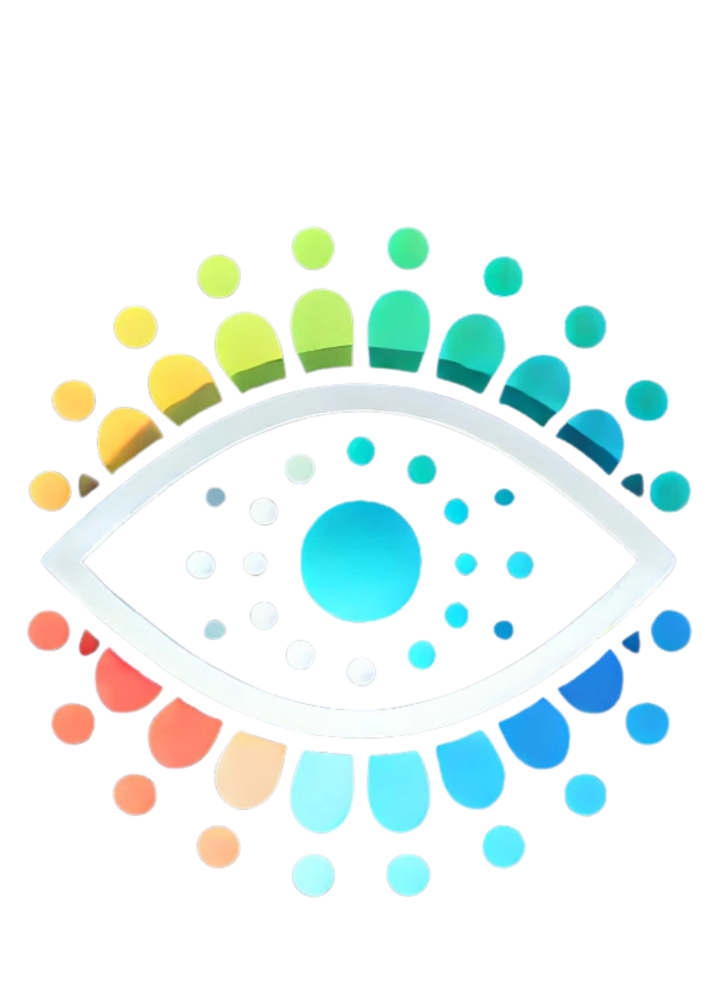
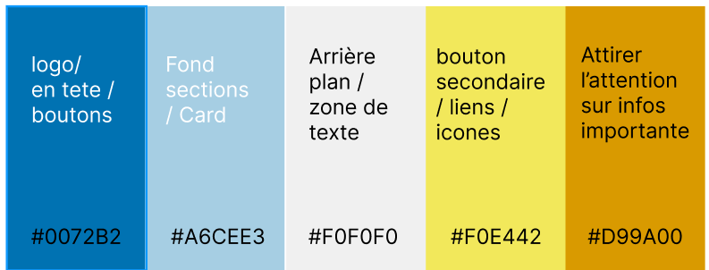

# Les Chill Bangers Peppers 

## 🚀 Bienvenue sur notre projet Hackathon réalisé à la Wild Code School

## 💡 Le concept

Nous devons réaliser un site qui permet l'inclusion des daltoniens dans une entreprise. 

## 🛠️ Fonctionnalités:

### 👥 Partie Visiteur: 

- L'utilisateur peut suivre des visions de daltonisme selon le type.
- L'utilisateur peut aller faire un test de daltonisme.
- L'utiliateur est sensibilisé à appliquer les bonnes méthodes afin de coopérer avec leur collègues souffrant de daltonisme.

## 💻 Technos utilisé

### 👥 Créateurs : 

[Mégane AUTHEMAYOU](https://github.com/megmayou) - [Amel BONNEVIE](https://github.com/BonnevieAmel) - [Pierre DELAROCQUE](https://github.com/PierreDelarocque) - [Nicolas JUCHEREAU](https://github.com/Nicolas-jchr)

### 🖌️ Notre chartre graphique : 

